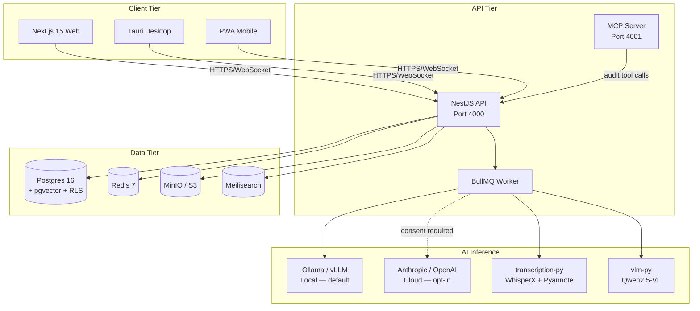

<!--
SPDX-License-Identifier: BUSL-1.1
-->

# AuditForge ISO 42001

[](LICENSE)
[](https://github.com/auditforge/auditforge/actions)

An exclusive workbench for **ISO/IEC 42001 Lead Auditors** performing
conformity assessment of AI Management Systems. It is not a tool for
auditees.



---

## What It Is

AuditForge provides:

- **Conversational audit engine** — AI-assisted question generation, clause
  attribution, and NC drafting. Every engine output is a draft; the auditor
  confirms every state change.
- **Evidence vault** — encrypted upload, VLM extraction (Qwen2.5-VL /
  DeepSeek-OCR), schema-constrained claim graph.
- **Working papers** — Yjs CRDT collaborative editing with full offline
  support.
- **Probe suite** — AC-*, P-LLM-*, P-MCP-*, P-DATA-*, P-RISK-*, P-GOV-*,
  P-AGENT-*, P-CHAIN-* conformance checks wrapping garak, PyRIT, and
  HarmBench.
- **Signed reports** — DOCX + PDF/A-3; Ed25519 + RFC 3161 TSA; hash-chained
  audit ledger.
- **Readiness Mode** — AIMS owners can self-assess with mandatory non-
  certification disclaimers.
- **MCP server** — expose audit tools to Claude Desktop or IDE via the Model
  Context Protocol.

---

## Who It Is For

| User | Use case |
|---|---|
| **ISO 42001 Lead Auditor** | Plan, execute, and sign formal Stage 1, Stage 2, surveillance, and re-certification audits |
| **Internal Auditor / AIMS Owner** | Run Readiness Mode self-assessments before engaging a CB |
| **Platform Operator** | Deploy and manage AuditForge for a certification body or enterprise |
| **Developer / Contributor** | Extend AuditForge with new conformance checks, domains, or MCP tools |

---

## Capability Matrix

| Capability | Status |
|---|---|
| ISO 42001:2023 full clause and Annex A catalogue | Shipped |
| Engagement lifecycle (Stage 1/2/surveillance/re-cert/readiness) | Shipped |
| Audit Mode / Readiness Mode | Shipped |
| Conversational engine (question gen, attribution, NC drafter) | Shipped |
| Live interview + WhisperX diarization | Shipped |
| VLM evidence extraction (Qwen2.5-VL / DeepSeek-OCR) | Shipped |
| Yjs CRDT working papers (offline-first) | Shipped |
| Probe suite (50+ probes across 8 categories) | Shipped |
| Findings workflow + peer review + QA checklist + CAPA | Shipped |
| Sampling planner (attribute/variable/stratified/judgmental) | Shipped |
| Signed reports (Ed25519 + RFC 3161 TSA + PDF/A-3) | Shipped |
| MCP server (9 tools, signed receipts) | Shipped |
| Cross-engagement memory (anonymized, opt-in) | Shipped |
| Air-gap mode (fully offline, local LLM) | Shipped |
| Surveillance engagements | Shipped |
| Cross-framework mapping (NIST AI RMF / EU AI Act / ISO 27001) | Shipped |
| Tauri desktop app | Shipped |
| PWA mobile | Shipped |

---

## How to Install

**Kubernetes (production)**:

```bash
helm repo add auditforge https://charts.auditforge.io
helm repo update
helm install auditforge auditforge/auditforge \
  --namespace auditforge --create-namespace \
  --values my-values.yaml
```

See [docs/operator-guide/03-installation.md](docs/operator-guide/03-installation.md)
for the full installation guide including air-gap deployment.

**Docker Compose (development)**:

```bash
git clone https://github.com/auditforge/auditforge.git
cd auditforge
cp .env.example .env.local
docker compose -f infra/docker-compose.dev.yml up -d
pnpm install && pnpm db:migrate && pnpm db:seed && pnpm dev
```

Web: http://localhost:3000 — API: http://localhost:4000

---

## How to Develop

```bash
pnpm install
docker compose -f infra/docker-compose.dev.yml up -d
pnpm db:migrate && pnpm db:seed
pnpm dev         # starts all apps in watch mode
pnpm test:unit   # Vitest unit tests
pnpm test:e2e    # Playwright end-to-end tests
pnpm lint        # ESLint + Prettier
pnpm typecheck   # TypeScript strict mode
```

Full onboarding guide: [docs/developer-guide/01-onboarding.md](docs/developer-guide/01-onboarding.md).

---

## Documentation

| Guide | Link |
|---|---|
| Auditor Guide (Lead Auditor manual) | [docs/auditor-guide/](docs/auditor-guide/01-overview.md) |
| Operator Guide (DevOps/SRE handbook) | [docs/operator-guide/](docs/operator-guide/01-overview.md) |
| Developer Guide (contributor onboarding) | [docs/developer-guide/](docs/developer-guide/01-onboarding.md) |
| Concepts (domain reference) | [docs/concepts/](docs/concepts/audit-ledger.md) |
| API Reference (167 endpoints) | [docs/api-reference/](docs/api-reference/README.md) |
| Compliance (ISO 42001 + ISO 27001 + SOC 2) | [docs/compliance/](docs/compliance/auditforge-self-attestation.md) |
| Tutorials | [docs/tutorials/](docs/tutorials/tutorial-01-first-engagement.md) |
| Architecture Decision Records | [docs/adr/](docs/adr/) |
| CHANGELOG | [docs/CHANGELOG.md](docs/CHANGELOG.md) |
| Docs index | [docs/README.md](docs/README.md) |

---

## License

**Business Source License 1.1** — see [LICENSE](LICENSE).

- Source available; not Open Source until the Change Date.
- Production use is permitted except for offering AuditForge as a
  competing hosted/embedded certification, audit-management, or AI-
  governance service.
- Converts to Apache-2.0 four years after each version's release.

See [NOTICE](NOTICE), [TRADEMARK.md](TRADEMARK.md), [CLA.md](CLA.md).

---

## Support

This repository is **private and single-owner maintained**. There is
no public issue tracker.

For all questions, bug reports, licensing inquiries, security
disclosures, and feature requests, contact:

**Ekessh Thoralingam** — <ekesshtks@gmail.com>

See [SUPPORT.md](SUPPORT.md) for response targets and
[SECURITY.md](SECURITY.md) for the responsible-disclosure protocol.

---

## Contributing

External pull requests, forks, and issues from non-licensed parties
are **not accepted**. See [CONTRIBUTING.md](CONTRIBUTING.md) and
[CLA.md](CLA.md) for the licensed-contributor process.

Every accepted commit must:

- Follow [Conventional Commits](https://www.conventionalcommits.org/).
- Include a DCO sign-off (`git commit -s`).
- Pass all per-PR gates (lint, typecheck, tests, SAST, SPDX headers).
- Be reviewed by the CODEOWNER (@ekessh).

---

## Security

Report vulnerabilities **privately** to <ekesshtks@gmail.com> per
[SECURITY.md](SECURITY.md). Do not open public GitHub issues for
security findings.

---

## Code of Conduct

See [CODE_OF_CONDUCT.md](CODE_OF_CONDUCT.md).
