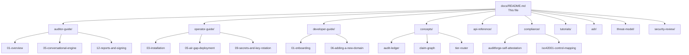

<!--
SPDX-License-Identifier: BUSL-1.1
-->

# AuditForge Documentation

> This index is the single entry point for all AuditForge documentation. Pick
> your audience below and follow the "Start here" link.

AuditForge is an exclusive workbench for ISO/IEC 42001 Lead Auditors. It is
**not** a tool for auditees. Every capability described in this documentation
is scoped to the auditor's perspective unless explicitly labelled "operator" or
"developer."

---

## Audience Matrix

| Audience | Role | Start here |
|---|---|---|
| **Lead Auditor** | Conducts AIMS audits; signs reports; manages findings | [Auditor Guide → Overview](auditor-guide/01-overview.md) |
| **Co-Auditor** | Supports the lead; edits working papers; limited promotion rights | [Getting Started](auditor-guide/02-getting-started.md) |
| **Operator / SRE** | Deploys, monitors, scales, and backs up AuditForge | [Operator Guide → Overview](operator-guide/01-overview.md) |
| **Developer / Contributor** | Extends or maintains the codebase | [Developer Guide → Onboarding](developer-guide/01-onboarding.md) |
| **Compliance Officer** | Maps AuditForge's own controls to ISO 42001, ISO 27001, SOC 2 | [Compliance → Self-Attestation](compliance/auditforge-self-attestation.md) |

---

## Project Status

| Wave | Phases covered | Key deliverables |
|---|---|---|
| Wave 1 | 0–5 | Core NestJS API, Drizzle schema, Postgres RLS, Auth.js + WebAuthn, Audit Ledger (Ed25519 + RFC 3161), basic probe runner, Next.js UI shell |
| Wave 2 | 6–7 | Evidence vault (MinIO), VLM extraction (Qwen2.5-VL / DeepSeek-OCR), Yjs CRDT working papers, Meilisearch + pgvector hybrid search, Tauri desktop, PWA mobile |
| Wave 3 | 7.5–7.7 | Audit Memory Layer, LLM Provider Abstraction, Conversational Engine (question generator, attribution, NC drafter, coverage tracker), live interview + WhisperX diarization, readiness/audit dashboards |
| Wave 4 | 8–14 | Peer review, QA checklist, CAPA tracking, sampling planner, surveillance module, cross-framework mapping, MCP server, cross-engagement memory, signing + PDF/A-3 report pipeline |

Current phase: **15 (in progress)** — cross-engagement memory, MCP server GA, compliance documentation.

---

## Documentation Map

---

## Cross-References

- **Architecture Decision Records**: [adr/](adr/)
- **Threat Model**: [threat-model/](threat-model/)
- **Security Review**: [security-review/](security-review/)
- **Probe Catalogue**: [security/probe-catalogue.md](security/probe-catalogue.md)
- **Operator Runbooks**: [../infra/runbooks/](../infra/runbooks/)
- **CHANGELOG**: [CHANGELOG.md](CHANGELOG.md)
- **Root README**: [../README.md](../README.md)
