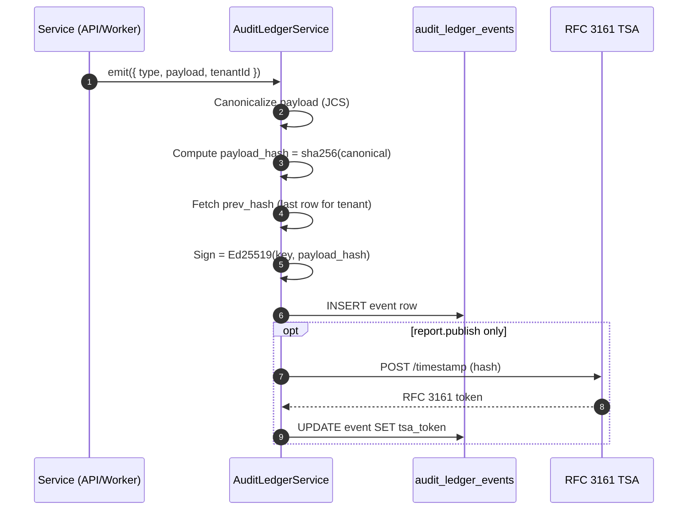

<!--
SPDX-License-Identifier: BUSL-1.1
-->
<!-- metadata
section: concepts
audience: developer, auditor, compliance-officer
adr: 0002, 0020
cross-refs:
  - docs/adr/0002-event-sourced-audit-ledger.md
  - docs/adr/0020-hash-chained-ledger-ed25519-tsa.md
  - docs/concepts/signing-and-tsa.md
-->

# Audit Ledger

> This document explains the event sourcing architecture, hash chain
> structure, signing, TSA anchoring, and projection rebuild used by the
> AuditForge audit ledger.

---

## Why an Audit Ledger

ISO 17021-1 §9.4 requires that audit records be authentic, complete,
and protected against unauthorized alteration. A traditional CRUD model
cannot prove tamper-free history. The audit ledger solves this with
event sourcing: every state change is an immutable, signed, hash-chained
event.

---

## Event Structure

Each row in `audit_ledger_events` carries:

| Field | Type | Description |
|---|---|---|
| `seq` | bigint | Monotonic per-tenant sequence number |
| `tenant_id` | uuid | Tenant (firm) the event belongs to |
| `event_type` | text | e.g. `engagement.created`, `claim.confirmed` |
| `payload` | jsonb | Event data (validated against schema registry) |
| `payload_hash` | bytea | SHA-256 of the canonical JSON payload (JCS) |
| `prev_hash` | bytea | `payload_hash` of the previous event in the chain |
| `signature` | bytea | Ed25519 signature over `payload_hash` |
| `key_id` | text | Identifier of the signing key used |
| `signed_at` | timestamptz | Wall clock time at signing |
| `tsa_token` | bytea | RFC 3161 timestamp token (null except for report.publish events) |
| `principal_id` | uuid | Auditor or system account that triggered the event |

---

## Hash Chain

The chain links events via `prev_hash`:

```
Event 0 (genesis)
  prev_hash = 0x0000…00 (32 zero bytes)
  signature = Ed25519(platform_genesis_key, payload_hash)

Event 1
  prev_hash = signature(Event 0)
  signature = Ed25519(firm_key, sha256(canonical_json(payload)))

Event N (report.publish)
  prev_hash = signature(Event N-1)
  signature = Ed25519(firm_key, ...)
  tsa_token = RFC 3161 token from TSA
```

See [../diagrams/ledger-chain.mmd](../diagrams/ledger-chain.mmd).

---

## Verification Algorithm

The chain verifier at
`packages/audit-engine/src/chain-verifier.ts` walks the chain:

1. For each event in ascending `seq` order:
   a. Recompute `payload_hash = sha256(jcs(payload))`.
   b. Assert `payload_hash == stored payload_hash`.
   c. Assert `prev_hash == signature of (seq - 1)`.
   d. Assert `Ed25519.verify(firm_public_key, signature, payload_hash)`.
   e. For `report.publish` events: parse the TSA token and assert that
      its `genTime` is within 60 seconds of `signed_at`.

A 50,000-event chain re-verifies in < 200 ms on commodity hardware.

---

## Projections

Operational tables (`engagements`, `findings`, `claims`, etc.) are
projections of the ledger. They are rebuilt by replaying events through
the projection function in `packages/audit-engine/src/projector.ts`.

The key invariant: **if the projection and the ledger disagree, the
ledger is correct**. Projections can be dropped and rebuilt at any time
without data loss.

---

## Event Sequence Diagram



---

## Retention and Partitioning

The `audit_ledger_events` table is range-partitioned by month using
`pg_partman`. Retention policy:

- Live partitions: 36 months rolling.
- Archived partitions: moved to cold tablespace; retained for the
  engagement's regulatory retention period (operator-configurable;
  default 7 years).
- Partitions are never deleted while any engagement in that month is
  within its retention period.

---

## Cross-References

- [ADR-0002](../adr/0002-event-sourced-audit-ledger.md) — design rationale.
- [ADR-0020](../adr/0020-hash-chained-ledger-ed25519-tsa.md) — signing
  algorithm choices.
- [signing-and-tsa.md](signing-and-tsa.md) — cryptographic walkthrough.
- `packages/audit-engine/src/chain-verifier.ts:1` — verifier source.
