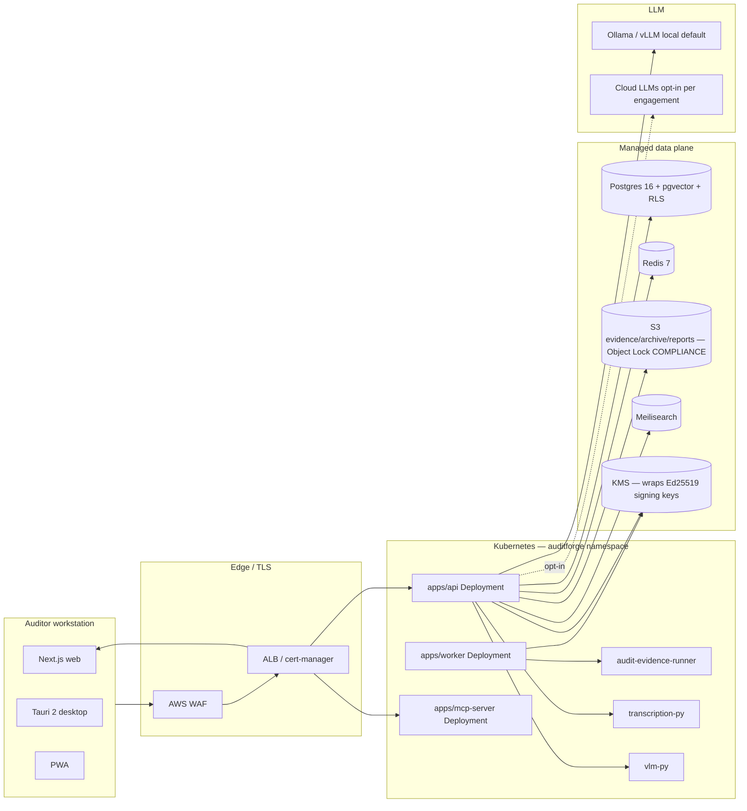

<!-- SPDX-License-Identifier: BUSL-1.1 -->
# AuditForge — Operations Architecture Overview

## Topology (single page)

## Key invariants

- **Single-tenant data plane logical isolation:** Postgres RLS per engagement; defense in depth at app layer
- **Audit ledger is hash-chained + Ed25519 signed:** any tampering breaks verification
- **Local LLM default:** cloud LLMs opt-in per engagement, blocked at provider layer in air-gap mode
- **Receipt chain end-to-end:** every state transition produces a signed receipt stored in `./receipts/`
- **Auditor confirmation is the only state-transition trigger:** engines emit drafts only

## Layer ownership

| Layer                  | Owner             | Doc                       |
| ---------------------- | ----------------- | ------------------------- |
| Web frontend           | Frontend team     | `apps/web/README.md`      |
| API + worker           | Backend team      | `apps/api/README.md`      |
| LLM provider routing   | ML platform team  | `packages/llm-provider/`  |
| K8s + Helm             | Platform team     | `infra/helm/`             |
| Cloud baselines        | Platform team     | `infra/terraform/`        |
| Observability          | SRE team          | `docs/operations/monitoring.md` |
| Compliance evidence    | Security team     | `infra/runbooks/compliance-evidence-generation.md` |
