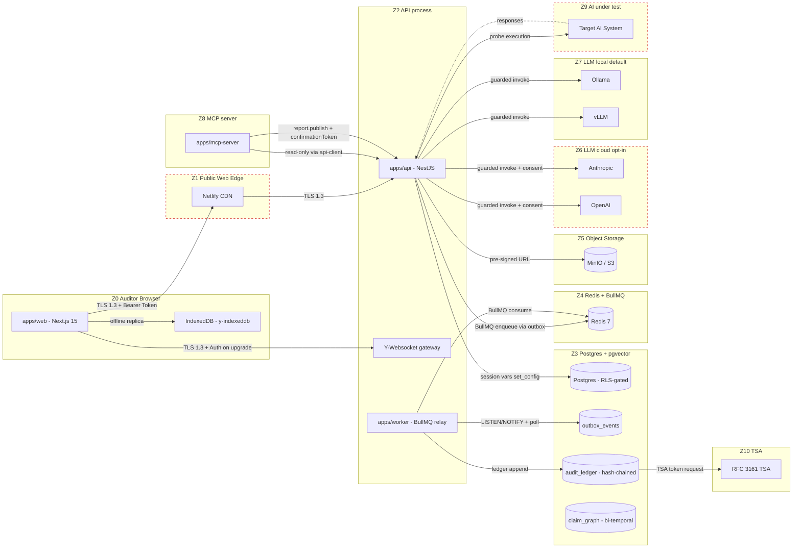

# AuditForge — System Context and Trust Boundaries

<!-- SPDX-License-Identifier: BUSL-1.1 -->

This document captures the high-level architecture of AuditForge with
explicit trust boundaries for use by the STRIDE analysis
(`stride-analysis.md`), DREAD scoring (`dread-scoring.md`), and the
mitigation tracker (`mitigation-tracker.md`).

## Trust Zones

| Zone | Trust level | Notes |
|------|-------------|-------|
| Z0 Auditor browser | Semi-trusted | Authenticated via WebAuthn; can be running unrelated tabs |
| Z1 Public web edge | Untrusted | Netlify edge / CDN; rewrites possible (see ADR-0027) |
| Z2 API process | Trusted | Inside the firm boundary; holds RLS session vars |
| Z3 Postgres | Trusted | Source of truth; RLS policies enforce tenant isolation |
| Z4 Redis / BullMQ | Trusted | Local network only; no public endpoint |
| Z5 Object storage (MinIO/S3) | Trusted | Per-firm bucket; pre-signed URLs only |
| Z6 LLM cloud | Untrusted | Anthropic / OpenAI; consent-gated, air-gap-disablable |
| Z7 LLM local | Trusted | Ollama / vLLM in firm network |
| Z8 MCP server (Phase 15) | Semi-trusted | Exposed to MCP clients; tool surface frozen |
| Z9 AI under test | Untrusted | The target of probe execution; assumed adversarial |
| Z10 TSA | Untrusted, attestable | RFC 3161 timestamp authority; chain-of-trust verified |

## Mermaid Architecture Diagram

## Data Flows In Scope

| ID | Data Flow | Trust crossings |
|----|-----------|------------------|
| F1 | Auditor login (WebAuthn) | Z0 → Z1 → Z2 → Z3 |
| F2 | Engagement create | Z0 → Z1 → Z2 → Z3 (and outbox to Z4) |
| F3 | Working paper edit (Yjs sync) | Z0 ↔ Z2 (WebSocket); Z2 → Z3 on snapshot |
| F4 | Probe execution against AI under test | Z2 → Z9 (egress); Z9 → Z2 (ingress, untrusted response) |
| F5 | Report publish (signing, TSA, ledger) | Z2 → Z3 (ledger), Z2 → Z10 (TSA), Z2 → Z5 (PDF) |
| F6 | LLM invocation (cloud + local) | Z2 → Z6 (cloud, gated) or Z2 → Z7 (local) |
| F7 | MCP tool call (Phase 15 onward) | Z8 → Z2 (read-only); for `report.publish`, Z8 → Z2 with confirmation token |

Each flow is decomposed in `stride-analysis.md` with threats,
countermeasures, file:line references where the mitigation lives, and
residual risk.

## Cross-cutting Controls

- **TLS 1.3** on every inter-zone link.
- **HSTS** with `max-age=31536000; includeSubDomains; preload`.
- **CSP** per ADR-0027 (interim) and the strict-CSP middleware
  (commit `d66f424`) ready behind a feature flag.
- **RLS** in Postgres (ADR-0017) — defense in depth on Z3.
- **Outbox** (ADR-0021) — atomic event emission preventing dual-write
  inconsistencies between Z3 and Z4.
- **Hash-chained ledger** (ADR-0020) — tamper evidence on Z3.
- **Air-gap + cloud-consent guards** (ADR-0025) — Z6 isolation.
- **Confirmation tokens** for state mutations (ADR-0016) — Z0 user
  intent attested before Z2 mutates Z3.
